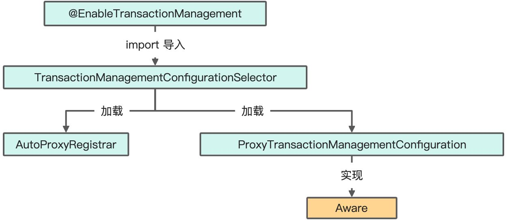
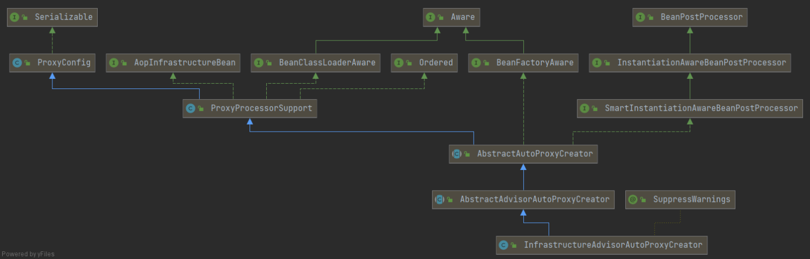
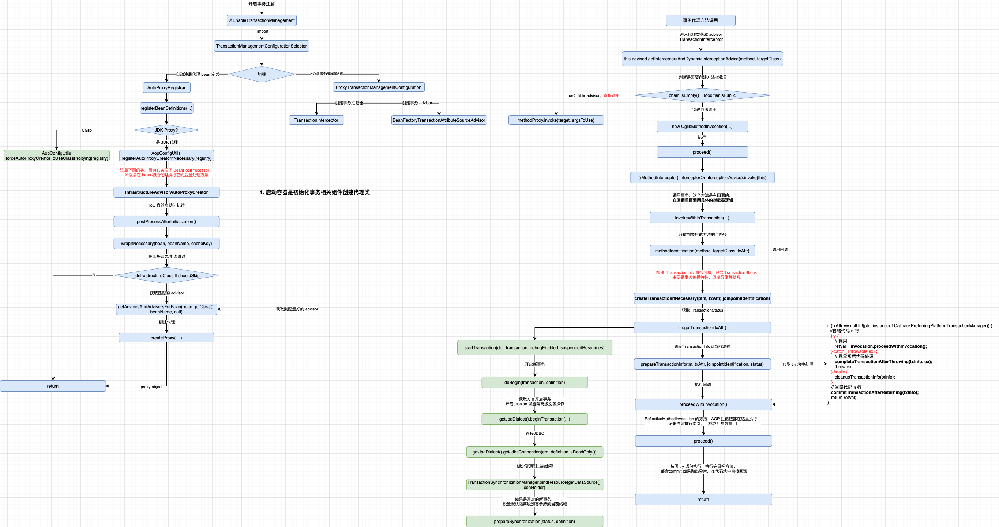

在关系型数据库开发中，事务是绕不开的一个环节，Spring 提供了健全的事务机制，联合 ORM 框架完成事务操作。

<!--more-->

## 事务

事务分为编程式事务和声明式事务。前者顾名思义，可以控制事务粒度但是和业务代码耦合较高，一般不采用。声明式事务通过 AOP 实现，在 IoC 容器启动的时候，在 BeanPostProcessor 后置处理器的后置方法中实现事务。

### Propagation

传播行为：当一个方法开启事务后，在方法中调用了其他的方法，其他方法可能也需要事务管理，此时就涉及事务该如何传播了。

1. PROPAGATION_REQUIRED：如果当前存在事务，则加入该事务；如果当前没有事务，则创建一个新的事务。默认
2. PROPAGATION_REQUIRES_NEW：创建一个新的事务，如果当前存在事务，则把当前事务挂起。
3. PROPAGATION_SUPPORTS：如果当前存在事务，则加入该事务；如果当前没有事务，则以非事务的方式继续运行。
4. PROPAGATION_NOT_SUPPORTED：以非事务方式运行，如果当前存在事务，则把当前事务挂起。
5. PROPAGATION_NEVER：以非事务方式运行，如果当前存在事务，则抛出异常。
6. PROPAGATION_MANDATORY：如果当前存在事务，则加入该事务；如果当前没有事务，则抛出异常。
7. PROPAGATION_NESTED：如果当前存在事务，则创建一个事务作为当前事务的嵌套事务来运行；如果当前没有事务，则该取值等价于TransactionDefinition.PROPAGATION_REQUIRED。

### 组件

**@EnableTransactionManagement**

开启事务管理。

### 类关系

自动代理主要的类 InfrastructureAdvisorAutoProxyCreator 继承关系，它本质其实是一个拥有 BeanPostProcessor 接口特性的类。

### 流程

也是基于 AOP 实现的流程，和一般的处理逻辑类似

***

🐑
