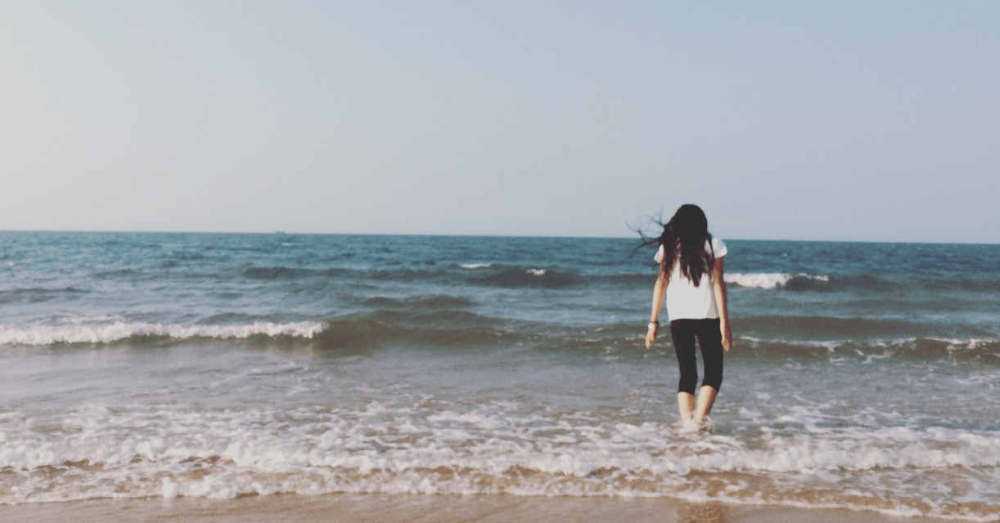

时间旅途
   

<!-- more -->

时间线

***

2015 年 3 月 14 号，我们在一起了。

那时我没有送她最爱的满天星

我们喜欢在学校周围的街边散步，一走就是几个小时。

感觉很开心。

在最好的年纪一起开心大笑过，一起流过泪。

市中心那家面馆

健身房下面的那家冰激凌店，还有农场里没有全开的樱花。

综合楼前的操场。

时间过的很快，转眼就毕业了。

时间走了，我们都在。

我很幸运。

***

现在

我们一起徒步上过华山，虽然这辈子都不想在爬第二次，但是觉得很值得。

6 月份的天在青海穿着棉袄

我们饶了青海湖一圈。

刚察很好玩，北方城市的沧桑和寂静给人不一样的感觉。

在重庆吃火锅，你眼睛不小心进了辣椒油，吃完感觉没有嘴了。

但我们还是默默都说还会再来。

到洪崖洞挤过人，也看了网红轻轨。

还有那个全是我们足迹的小岛。

这只是开始。

